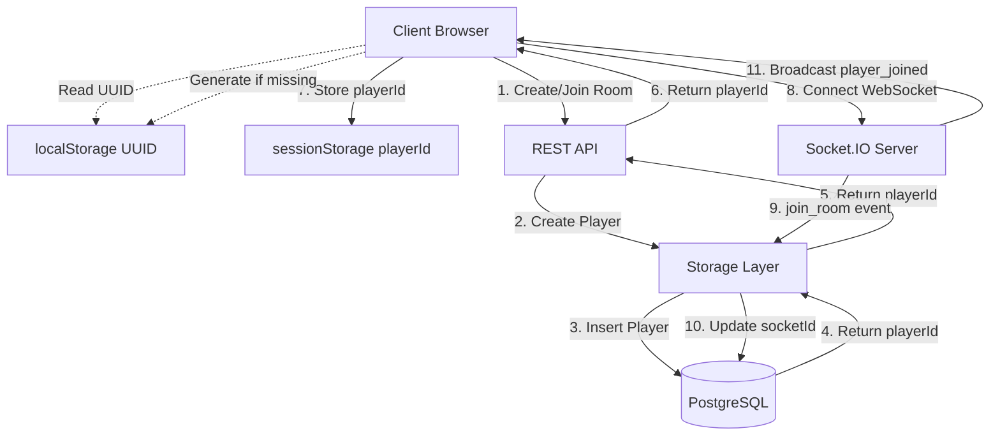

# Design Document - Multiplayer Synchronization Fix

## Overview

Este documento descreve o design técnico para corrigir os problemas de sincronização multiplayer no Urban Poly. A solução implementa um sistema robusto de identificação de jogadores baseado em UUID persistente, sincronização em tempo real via WebSocket, e gerenciamento adequado de conexões/desconexões.

O design aborda os seguintes problemas críticos identificados:
- Player ID inválido (0) bloqueando conexões WebSocket
- Falta de identificação persistente de jogadores
- Ausência de limpeza em desconexões
- Duplicação de registros de jogadores
- Dependência excessiva de polling

## Architecture

### High-Level Architecture



### Component Interaction Flow

**Room Creation/Join Flow:**
1. Client gera ou recupera UUID do localStorage
2. Client envia POST /api/rooms com { city, nickname, clientId }
3. Server cria sala e jogador no banco de dados
4. Server retorna { roomCode, playerId, token }
5. Client armazena playerId no sessionStorage
6. Client inicializa conexão WebSocket
7. Client emite join_room com { code, playerId, clientId }
8. Server valida e atualiza socketId do jogador
9. Server emite player_joined para todos na sala

**Disconnection Flow:**
1. Socket desconecta (rede, fechamento de aba, etc.)
2. Server detecta evento disconnect
3. Server busca jogador por socketId
4. Server atualiza socketId para null
5. Server emite player_disconnected para sala
6. Clients atualizam UI removendo/marcando jogador offline

**Reconnection Flow:**
1. Client detecta desconexão
2. Client tenta reconectar automaticamente
3. Ao reconectar, emite join_room com playerId existente
4. Server valida clientId e atualiza socketId
5. Server emite player_reconnected para sala

## Components and Interfaces

### 1. Client ID Manager (Frontend)

**Responsabilidade:** Gerenciar UUID persistente do cliente

**Interface:**
```typescript
class ClientIdManager {
  private static readonly STORAGE_KEY = 'urbanpoly_client_id';
  
  static getOrCreateClientId(): string {
    let clientId = localStorage.getItem(this.STORAGE_KEY);
    if (!clientId) {
      clientId = crypto.randomUUID();
      localStorage.setItem(this.STORAGE_KEY, clientId);
    }
    return clientId;
  }
  
  static getClientId(): string | null {
    return localStorage.getItem(this.STORAGE_KEY);
  }
}
```

**Localização:** `/client/src/lib/client-id.ts`

### 2. Enhanced Storage Layer (Backend)

**Responsabilidade:** Operações CRUD com suporte a upsert e queries por clientId

**Interface Additions:**
```typescript
interface IStorage {
  // Existing methods...
  
  // New methods
  getPlayerByClientId(clientId: string, roomId: number): Promise<Player | undefined>;
  upsertPlayer(player: UpsertPlayer): Promise<Player>;
  updatePlayerSocket(playerId: number, socketId: string | null): Promise<Player>;
  deletePlayer(playerId: number): Promise<void>;
  getPlayerById(playerId: number): Promise<Player | undefined>;
}

interface UpsertPlayer {
  clientId: string;
  roomId: number;
  nickname: string;
  socketId: string;
  color: string;
  isHost: boolean;
}
```

**Implementação:**
```typescript
async upsertPlayer(player: UpsertPlayer): Promise<Player> {
  const existing = await this.getPlayerByClientId(player.clientId, player.roomId);
  
  if (existing) {
    return await this.updatePlayer(existing.id, {
      socketId: player.socketId,
      nickname: player.nickname
    });
  }
  
  return await this.createPlayer(player);
}
```

**Localização:** `/server/storage.ts`

### 3. Enhanced REST API Endpoints (Backend)

**POST /api/rooms (Create Room)**

**Input:**
```typescript
{
  city: string;
  nickname: string;
  clientId: string;
}
```

**Output:**
```typescript
{
  roomCode: string;
  playerId: number;  // Real player ID, not 0
  token: string;
}
```

**Logic:**
1. Validate input
2. Generate unique room code
3. Create room in database
4. Create player with isHost=true, socketId="pending"
5. Return real playerId

**POST /api/rooms/join (Join Room)**

**Input:**
```typescript
{
  code: string;
  nickname: string;
  clientId: string;
}
```

**Output:**
```typescript
{
  roomCode: string;
  playerId: number;
  token: string;
}
```

**Logic:**
1. Validate room exists
2. Check room not full (max 4 players)
3. Check room status is "waiting"
4. Upsert player (update if clientId exists, create otherwise)
5. Return playerId

**Localização:** `/server/routes.ts`

### 4. Enhanced WebSocket Event Handlers (Backend)

**Event: join_room**

**Input:**
```typescript
{
  code: string;
  playerId: number;
  clientId: string;
  nickname: string;
}
```

**Logic:**
1. Validate room exists
2. Validate playerId and clientId match
3. Update player socketId to socket.id
4. Join socket to room
5. Fetch all players in room
6. Emit player_joined to all in room

**Event: disconnect**

**Logic:**
1. Find player by socketId
2. If found, update socketId to null
3. Emit player_disconnected to room
4. If player was host, promote next player
5. Schedule cleanup after 60s if not reconnected

**Event: heartbeat**

**Input:**
```typescript
{
  playerId: number;
}
```

**Logic:**
1. Update player lastSeen timestamp
2. No response needed

**Localização:** `/server/routes.ts`

### 5. Enhanced useGameSocket Hook (Frontend)

**Responsabilidade:** Gerenciar conexão WebSocket e sincronização de estado

**Interface:**
```typescript
function useGameSocket(roomCode: string, playerId: number) {
  return {
    isConnected: boolean;
    connectionError: string | null;
    startGame: () => void;
    rollDice: () => void;
    buyProperty: () => void;
    endTurn: () => void;
  };
}
```

**Key Changes:**
1. Remove falsy check on playerId (allow 0 to fail explicitly)
2. Add explicit validation: `if (!playerId || playerId === 0)`
3. Send clientId in join_room event
4. Implement heartbeat every 10s
5. Handle player_disconnected event
6. Handle player_reconnected event
7. Auto-reconnect on disconnect

**Localização:** `/client/src/hooks/use-game.ts`

## Data Models

### Updated Schema

**players table:**
```typescript
{
  id: serial PRIMARY KEY,
  roomId: integer NOT NULL REFERENCES rooms(id) ON DELETE CASCADE,
  clientId: text NOT NULL,  // NEW: UUID from client
  socketId: text,           // CHANGED: nullable
  nickname: text NOT NULL,
  money: integer DEFAULT 2000,
  position: integer DEFAULT 0,
  color: text NOT NULL,
  isHost: boolean DEFAULT false,
  isJailed: boolean DEFAULT false,
  jailTurns: integer DEFAULT 0,
  lastSeen: timestamp DEFAULT NOW(),  // NEW: for heartbeat
  
  UNIQUE(roomId, clientId)  // NEW: prevent duplicates
}
```

**Migration Steps:**
1. Add clientId column (nullable initially)
2. Generate UUIDs for existing players
3. Add lastSeen column with default NOW()
4. Make socketId nullable
5. Add unique constraint on (roomId, clientId)
6. Create index on clientId for fast lookups

### Database Indexes

```sql
CREATE INDEX idx_players_client_id ON players(clientId);
CREATE INDEX idx_players_socket_id ON players(socketId) WHERE socketId IS NOT NULL;
CREATE INDEX idx_players_room_id ON players(roomId);
CREATE UNIQUE INDEX idx_players_room_client ON players(roomId, clientId);
```

## Error Handling

### Client-Side Errors

**Connection Errors:**
- Display toast notification
- Show reconnecting overlay
- Retry connection up to 3 times
- Redirect to home if all retries fail

**Validation Errors:**
- Display toast with specific error message
- Keep user on current page
- Allow retry

**Room Full/Started Errors:**
- Display modal with error
- Redirect to home after acknowledgment

### Server-Side Errors

**Error Response Format:**
```typescript
{
  code: string;        // e.g., "ROOM_NOT_FOUND"
  message: string;     // User-friendly message
  details?: any;       // Additional context for debugging
}
```

**Error Codes:**
- `ROOM_NOT_FOUND`: Room code doesn't exist
- `ROOM_FULL`: Maximum 4 players reached
- `GAME_STARTED`: Cannot join game in progress
- `INVALID_PLAYER`: Player ID doesn't match client ID
- `UNAUTHORIZED`: Not host or not your turn

**Error Handling Strategy:**
1. Log full error with stack trace
2. Return sanitized error to client
3. Emit error event via WebSocket when applicable
4. Maintain system state consistency

## Testing Strategy

### Unit Tests

**Client-Side:**
- ClientIdManager generates and persists UUID
- useGameSocket validates playerId before connecting
- Event handlers update React Query cache correctly

**Server-Side:**
- Storage upsert logic (create vs update)
- Player validation in join_room
- Disconnect cleanup logic
- Heartbeat timestamp updates

### Integration Tests

**WebSocket Flow Tests:**
1. Create room → Player created with valid ID
2. Join room → Second player appears in first player's UI
3. Disconnect → Player removed from lobby
4. Reconnect → Same player restored with same ID
5. Start game → All players receive game_started event
6. Roll dice → All players receive game_update

**Database Tests:**
1. Unique constraint prevents duplicate (roomId, clientId)
2. Cascade delete removes players when room deleted
3. Upsert updates existing player instead of creating duplicate

### End-to-End Tests

**Scenario 1: Two Players Join and Play**
1. Open browser 1, create room
2. Open browser 2, join room
3. Verify browser 1 sees player 2 instantly
4. Browser 1 starts game
5. Verify both browsers show game screen
6. Browser 1 rolls dice
7. Verify browser 2 sees dice result

**Scenario 2: Reconnection**
1. Player joins room
2. Simulate network disconnect
3. Verify player marked as disconnected
4. Restore network
5. Verify player reconnects with same ID

**Scenario 3: Host Disconnect**
1. Host creates room
2. Two players join
3. Host disconnects
4. Verify second player promoted to host
5. New host can start game

### Performance Tests

**Metrics to Monitor:**
- WebSocket event latency (target: <100ms)
- Database query time for getPlayersInRoom (target: <50ms)
- Memory usage with 10 concurrent rooms
- CPU usage during high event frequency

**Load Testing:**
- 50 concurrent rooms with 4 players each
- 10 events per second per room
- Monitor for memory leaks
- Verify no event loss

## Security Considerations

**Client ID Validation:**
- Server must validate clientId matches playerId
- Prevent player impersonation
- Rate limit join_room events

**Room Code Security:**
- 6-character alphanumeric codes (36^6 = 2B combinations)
- Expire unused rooms after 24 hours
- Limit room creation per IP (10/hour)

**WebSocket Security:**
- Validate all event payloads with Zod schemas
- Sanitize user input (nicknames, etc.)
- Prevent SQL injection in storage layer
- Rate limit events per socket (100/minute)

**Data Privacy:**
- Don't log sensitive information
- Clear player data when room deleted
- No PII stored (only nicknames and game state)

## Deployment Strategy

**Phase 1: Database Migration**
1. Run migration to add clientId, lastSeen columns
2. Populate clientId for existing players
3. Add unique constraint
4. Verify no data loss

**Phase 2: Backend Deployment**
1. Deploy updated storage layer
2. Deploy updated REST API endpoints
3. Deploy updated WebSocket handlers
4. Monitor error logs

**Phase 3: Frontend Deployment**
1. Deploy ClientIdManager
2. Deploy updated useGameSocket
3. Deploy updated lobby/game pages
4. Monitor user reports

**Rollback Plan:**
- Keep old code in separate branch
- Database migration is reversible
- Feature flag to disable new flow
- Gradual rollout (10% → 50% → 100%)

## Monitoring and Observability

**Metrics to Track:**
- WebSocket connection success rate
- Average time from join to player_joined event
- Disconnect/reconnect frequency
- Database query performance
- Error rate by error code

**Logging:**
- Log all WebSocket events with timestamps
- Log database operations with duration
- Log errors with full context
- Use structured logging (JSON format)

**Alerts:**
- WebSocket connection rate < 95%
- Database query time > 200ms
- Error rate > 5%
- Memory usage > 80%

## Future Enhancements

**Phase 2 Features:**
- Spectator mode (join after game started)
- Player kick/ban functionality
- Room password protection
- Persistent game state (resume after disconnect)

**Phase 3 Features:**
- Voice chat integration
- Replay system
- Leaderboards
- Custom game rules

## Conclusion

Este design resolve os problemas críticos de sincronização implementando:
1. Identificação persistente via UUID
2. Validação adequada de player ID
3. Sincronização em tempo real via WebSocket
4. Gerenciamento robusto de desconexões
5. Constraints de banco de dados para integridade

A implementação é incremental, testável e permite rollback seguro. O sistema resultante será responsivo, confiável e escalável.
